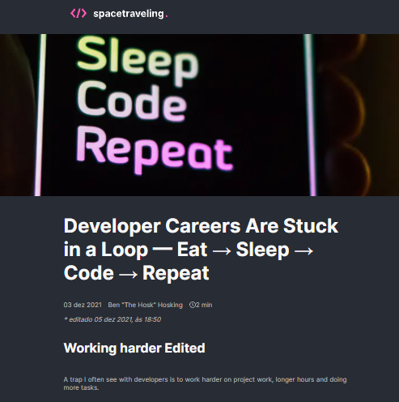
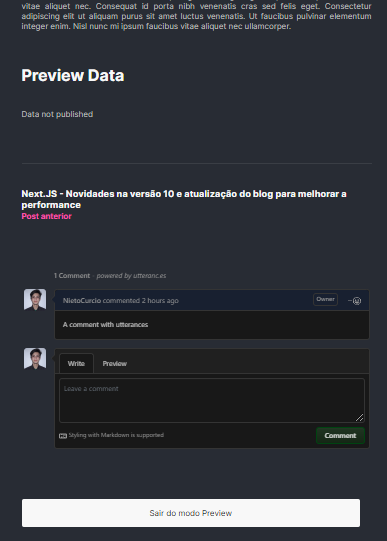

# Prismic API & Figma

  

## Prismic Headless CMS

### Home

O app realiza uma requisição para a API do Prismic para carregar os posts e verificar se existe uma próxima paginação de posts (atualizando conforme o usuário clica em "Carregar mais posts"). Isto é feito atravéz da manuntenção do estado do componente.

### Post

Ao carregar as informações do post, também é feito uma requisição para resgatar o próximo post e o post anterior em respeito ao post atual e permitir a navegação entre publicações na página do post.

### Prismic Preview

Um recurso poderoso do Prismic é permitir a visualização do preview do conteúdo a ser postado antes de publicá-lo em produção, isso ocorre atravéz da [integração do Prismic com o Next.js](https://prismic.io/docs/technologies/previews-nextjs).

### Utterances

Com o [utterances](https://github.com/utterance/utterances) é possível comentar em um post sem configurar um back-end para armazenar os comentários. A ferramenta se conecta ao repositório e armazena os comentários do post nos "issues" do repo.

## Figma

Neste desafio é preciso construir a interface da aplicação conforme projetado no Figma.
